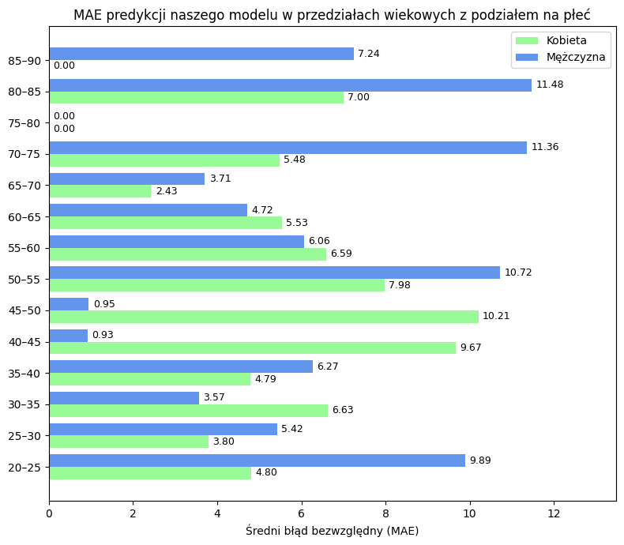

# Raport z replikacji: Predykcja wieku biologicznego na podstawie MRI mózgu
## 1. Opis zadania i pytania badawcze
Naszym zadaniem było odtworzenie pełnego procesu treningu i testowania modelu konwolucyjnej sieci neuronowej (CNN) do predykcji biologicznego wieku mózgu przedstawionego w publikacji *A deep learning model for brain age prediction using minimally preprocessed T1w images as input* (Dartora et al., 2024), z zastosowaniem nowego, zewnętrznego zbioru danych – IXI Dataset. Model opisany w artykule uczy się na podstawie obrazów MRI mózgu osób zdrowych typowych zmian zachodzących wraz z wiekiem, aby w późniejszych zastosowaniach umożliwić szacowanie tzw. biologicznego wieku mózgu. Odchylenia tego wieku od wieku metrykalnego mogą odzwierciedlać przyspieszone lub opóźnione starzenie się mózgu i stanowić cenny wskaźnik ryzyka wystąpienia chorób neurodegeneracyjnych, takich jak choroba Alzheimera.

Postawione przez nas pytania badawcze brzmiały:
- Czy model zaproponowany przez autorów publikacji przetrenowany na nowym zbiorze danych MRI osób zdrowych osiąga porównywalną dokładność predykcji wieku względem modelu oryginalnego? Jakie mogą być powody ewentualnych różnic?
- Czy dokładność predykcji wieku mózgu przez drugi model różni się istotnie między kobietami i mężczyznami? Jeśli tak, czy różnice te wskazują na różne stopnie dopasowania modelu do wzorców strukturalnych charakterystycznych dla płci?

Zadanie replikacji obejmowało trzy główne etapy:
1.	Preprocessing danych obrazowych MRI (T1-weighted) – przestrzenne wyrównanie do wzorca
2.	Trening modelu z wykorzystaniem wydzielonych zbiorów treningowego i walidacyjnego, dopasowany do dostępnych zasobów obliczeniowych
3.	Ewaluacja modelu na zbiorze testowym

Następnie aby porównać skuteczność obydwu modeli i przeprowadzić analizę wyników oraz zbiorów danych wykonałyśmy następujące operacje:
- Ewaluacja modelu oryginalnego na zbiorze testowym IXI,
- Porównanie uzyskanych wyników predykcji na podstawie kilku różnych metryk oraz na wykresach (wykresy skrzynkowe, wykresy rozrzutu, wykresy słupkowe MAE),
- Analiza wyników i zbadanie różnic z wykorzystaniem wizualizacji eksploracyjnych danych wejściowych, także z uwzględnieniem podziału według płci.

## 2. Krótki opis metody z publikacji
...

## 3. Dane
### Dane użyte przez autorów
Autorzy korzystali z dużego zbioru danych obrazowania MRI T1-weighted (T1w) od zdrowych osób dorosłych w wieku od 32 do 96 lat. Dane pochodziły z różnych otwartych źródeł (kohort), obejmujących łącznie 17 296 skanów MRI. Poniżej znajduje się diagram opisujący te dane.

### Dane użyte do replikacji treningu i ewaluacji
W badaniu wykorzystano dane z IXI dataset, obejmujące wyłącznie obrazy MRI T1-weighted (T1w) oraz odpowiadający im plik CSV z danymi demograficznymi (wiek, płeć). Zbiór ten zawiera skany około 600 zdrowych dorosłych osób w wieku od 18 do 87 lat z trzech londyńskich szpitali, wykonane różnymi skanerami (1.5T i 3T). Poniżej znajduje się rozkład wieku w tym zbiorze.

#### Rozkład wieku w naszym zbiorze

   
   

## 4. Preprocessing

W artykule, którym się zajmowałyśmy, sposób w jaki wykonany został preprocessing odgrywał kluczową rolę. Celem autorów było jego uproszczenie i udało im się to osiągnąć wykorzystując do preprocessingu wyłącznie jeden krok. Zastosowano tzw. rigid registration obrazów T1-weighted do wzorca MNI (Montreal Neurological Institute template space). Metoda ta polega na wyrównaniu każdego obrazu MRI do standardowego wzorca mózgu, czyli obraz jest jedynie przesuwany i obracany. Znacznie upraszcza to zastosowanie modelu na szerszą skalę, ponieważ preprocessing trwa krótko oraz nie potrzeba bardzo dużych zasobów do jego wykonania. 

W celu wykonania preprocessingu należało wykonać następujące kroki:
- zainstalować pakiet FSL, służący do analizy obrazów MRI. Z pakietu wykorzystano narzędzie FLIRT, które używane jest do liniowej rejestracji obrazów medycznych, czyli dopasowywania jednego obrazu do drugiego, tak aby struktury anatomiczne się pokrywały.
- stworzyć plik .csv w odpowiednim formacie, zawierający między innymi wiek pacjenta, ścieżkę do zdjęcia MRI oraz podział na zbiory testowy, treningowy i walidacyjny. 
- Uruchomić skrypt **`brain_age_trainer_preprocessing.py`**, który wykonuje rigid registration z 6 stopniami swobody wykorzystując narzędzie FLIRT i zapisuje wyniki do określonego folderu. 

Wykonanie rejestracji trwa około jednej minuty na obraz, co jest znaczącym skróceniem czasu w porównaniu do bardziej złożonych procedur preprocessingowych.

## 5. Opis modelu

### Model ResNet3D

W publikacji wykorzystano trójwymiarowy model sieci rezydualnej (**ResNet3D**), zaprojektowany do analizy danych przestrzennych o wymiarach `[wysokość, szerokość, głębokość]`.
Aby zwiększyć dokładność predykcji, autorzy zastosowali **ensemble pięciu niezależnie wytrenowanych modeli ResNet3D**. Ostateczna predykcja była uzyskiwana poprzez uśrednienie wyników wszystkich modeli (średnia arytmetyczna). 

Kążdy z 5 modeli składa się z następujących komponentów:

#### 1. Część konwolucyjna (`ResidualNet3D`)
Zawiera sześć bloków rezydualnych typu **bottleneck**, wykorzystujących warstwy:
- `Conv3D` – konwolucje trójwymiarowe,
- `BatchNorm3D` – normalizacja wsadowa,
- `LeakyReLU` – funkcja aktywacji.

Dodatkowo uwzględniono:
- warstwę początkową z konwolucją 7×7×7 i `MaxPooling3D`,
- końcowe uśrednianie przestrzenne za pomocą `AvgPooling3D`.

#### 2. Bloki rezydualne
Każdy blok wykorzystuje **residual connections**, które umożliwiają dodanie wejścia do wyjścia danego bloku. Mechanizm ten wspiera propagację gradientu, co pozwala efektywnie uczyć głębokie sieci neuronowe.

#### 3. Część w pełni połączona
Po ekstrakcji cech następuje:
- spłaszczenie danych (`flatten`),
- przejście przez trzy warstwy w pełni połączone (`Linear`) z funkcjami aktywacji `ReLU`.

Zadaniem tej części jest **regresja**, tzn. model zwraca pojedynczą wartość liczbową na wyjściu.

## 6. Trening modelu

Ze względu na ograniczone zasoby obliczeniowe dostępne w środowisku Colab, trening modelu przeprowadzono w kilku etapach:

1. **Podział treningu na partie:**
   - Trening odbywał się w trzech fazach:
     - **Pierwsza faza:** 5 epok
     - **Druga faza:** kolejne 5 epok
     - **Trzecia faza:** ostatnie 10 epok
   - Łącznie model był trenowany przez 20 epok, z przerwami na ładowanie wag.

2. **Wczytywanie wag między fazami:**
   - Po zakończeniu każdej fazy treningu:
     - Zapisane zostały finalne wagi modelu (`.pth`).
     - Następnie wczytywane były wagi z poprzedniego etapu, aby kontynuować trening od momentu, w którym został przerwany.
   - Dzięki temu możliwe było zachowanie ciągłości uczenia pomimo restartów sesji i ograniczeń pamięci.

Do trenowania modelu wykorzystano skrypt  **`brain_age_trainer_holdout.py`** znajdujący się na Githubie autorów artykułu. Został on lekko zmodyfikowany, aby można było wczytywać wagi z poprzedniego etapu treningu. 

#### Główne etapy treningu:

1. **Wczytanie i przygotowanie danych:**
   - Dane wczytywane są z pliku CSV, który zawiera ścieżki do przetworzonych i zarejestrowanych obrazów oraz informacje o wieku i podziale na zbiory (`train`, `dev`, `test`).
   - Na zbiorze treningowym stosowana jest augmentacja obrazów, na zbiorach walidacyjnych i testowych brak augmentacji.

2. **Tworzenie zestawów danych i loaderów:**
   - Tworzone są zestawy danych dla treningu, walidacji (dev) i opcjonalnie testów.
   - Dane ładowane są wsadowo (`batch_size=20`), z równoległym wczytywaniem.

3. **Inicjalizacja modelu i optymalizatora:**
   - Trenowanych jest 5 modeli ResNet3D jako zespół (ensemble).
   - Używany jest optymalizator SGD z początkową stopą uczenia 0.002, która co 5 epok zmniejszana jest dziesięciokrotnie.
   - Funkcja straty to błąd bezwzględny (MAE).

4. **Trening:**
   - Model uczy się przez określoną liczbę epok (domyślnie 20).
   - W każdej epoce przeprowadzane jest uczenie na zbiorze treningowym oraz ocena na zbiorze walidacyjnym.
   - Po ostatniej epoce, jeśli istnieje zbiór testowy, wykonywana jest ewaluacja na tym zbiorze.

5. **Ewaluacja i monitorowanie:**
   - Podczas treningu i ewaluacji zapisywane są metryki MAE oraz korelacja Pearsona między przewidywanym a rzeczywistym wiekiem.
   - Tworzone są wykresy rozrzutu dla każdej epoki i modelu, zapisywane do TensorBoard.
   - Obliczana jest także średnia predykcja (ensemble) z 5 modeli.

6. **Zapis wyników i modeli:**
   - Po każdej epoce zapisywane są wagi modeli w formacie `.pth`.
   - Wyniki predykcji zapisywane są do plików CSV w katalogu wyników.

### Podsumowanie

- Model jest trenowany na przetworzonych obrazach MRI.
- Wykorzystuje się augmentację do zwiększenia zróżnicowania danych treningowych.
- Stosuje się metodę ensemble 5 modeli ResNet3D, co zwiększa stabilność predykcji.
- Stopa uczenia jest adaptacyjnie zmniejszana co 5 epok.
- Monitorowanie odbywa się przy pomocy TensorBoard, z zapisem metryk i wykresów.

### Zmiany kótre zostały przez nas wprowadzone
- możliwość wczytania wag z poprzedniego treningu
  

## 7. Porównanie wyników

Aby ocenić jakość predykcji naszego modelu, porównałyśmy jego wyniki z rezultatami przedstawionymi w oryginalnym artykule referencyjnym. Do analizy wykorzystałyśmy dane testowe (takie, których nasz model nie widział podczas treningu).

### Wykorzystane metryki:

- **MAE (Mean Absolute Error)** – średni błąd bezwzględny.
- **RMSE (Root Mean Squared Error)** – pierwiastek z błędu średniokwadratowego.
- **R² (R-squared)** – współczynnik determinacji, mierzący dopasowanie modelu do danych.
- **Pearson r** – współczynnik korelacji liniowej między predykcjami a rzeczywistym wiekiem.

### Wyniki:

| Model               | MAE   | RMSE   | R²    | Pearson r |
|--------------------|-------|--------|-------|-----------|
| Nasz model         | 6.26  | 60.61  | 0.78  | 0.88      |
| Model z artykułu   | 12.67 | 253.75 | 0.08  | 0.88      |

> **Uwaga:** W publikacji autorzy podali także wynik MAE = **2.99**, uzyskany przy użyciu znacznie większego oraz bardziej zróżnicowanego zbioru danych.

### Wizualizacje

Poniżej przedstawiamy porównanie rozkładu wieku rzeczywistego, wieku przewidzianego przez nasz model oraz wieku przewidzianego przez model z artykułu (boxploty):

  
   

   
   

Wizualizacje zawarte w artykule:

### Ograniczenia porównania

Zdajemy sobie sprawę, że to porównanie ma ograniczoną wartość poznawczą:

- Ze względu na ograniczone zasoby obliczeniowe (Google Colab), nasz model był trenowany w małych porcjach: **2×5 epok**, a następnie **10 epok**, przy każdej kolejnej turze wczytując finalne wagi z poprzedniej.
- Mniejsza liczba danych i epok treningowych może znacząco wpływać na jakość predykcji.

## 8. Wnioski

1. Na podstawie analizy wyników oryginalnego modelu na zbiorze testowym IXI zaobserwowano systematyczne zawyżanie przewidywanego wieku biologicznego u osób młodszych (poniżej 40. roku życia). Model ten trenowany był na obrazach MRI osób w wieku 32–96 lat, z których zdecydowana większość miała powyżej 45 lat. Nie miał więc dostępu do przykładów mózgów młodych osób, co najprawdopodobniej uniemożliwiło mu nauczenie się charakterystycznych wzorców anatomicznych dla tej grupy wiekowej. W rezultacie predykcje dla młodszych osób są przesunięte w stronę wieku, który model znał z danych treningowych, co skutkuje wyraźnym błędem systematycznym. Obserwacja ta potwierdza, że dobór reprezentatywnego i zróżnicowanego zbioru treningowego — obejmującego pełny zakres wiekowy — ma kluczowe znaczenie dla możliwości uogólnienia modelu na nowe dane.
